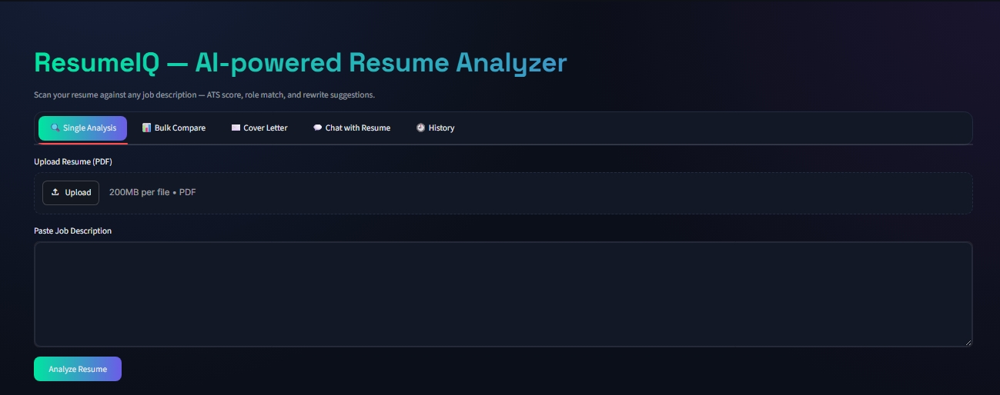
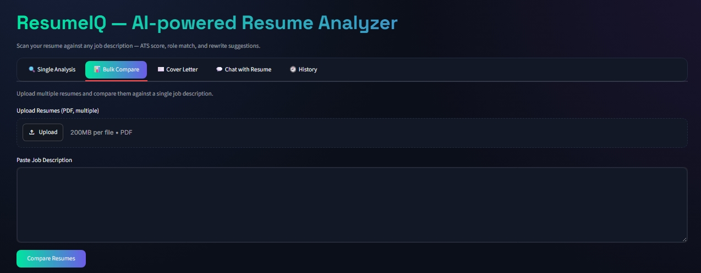
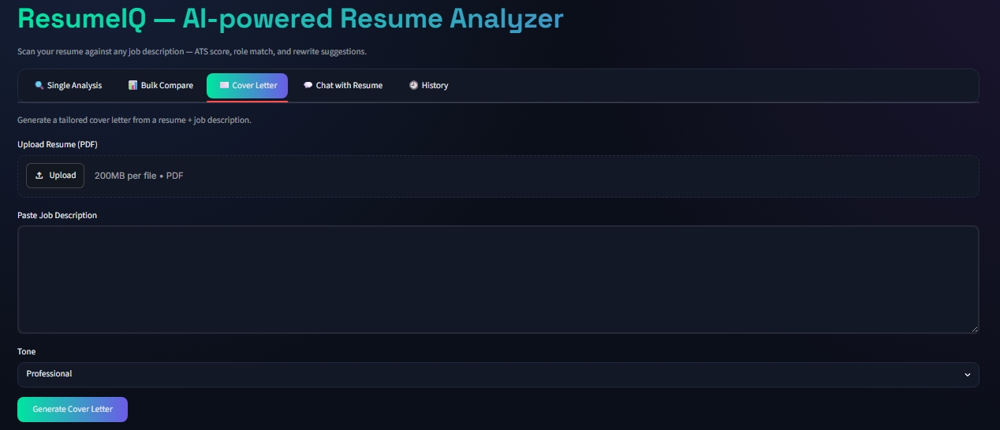
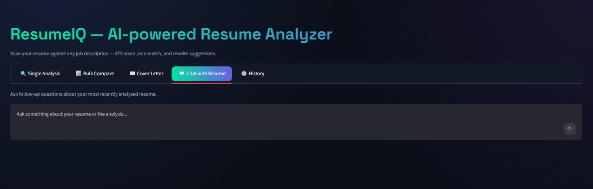

# 🚀 ResumeIQ

### AI-Powered Resume Analysis, ATS Scoring & Career Optimization Platform

ResumeIQ is an intelligent AI-powered platform that helps job seekers optimize their resumes for Applicant Tracking Systems (ATS), predict suitable job roles, identify missing keywords, generate personalized cover letters, and receive actionable career insights.

🌐 **Live Demo:** https://resumeiq-umfhd3m4srmw7aa2ecpynp.streamlit.app/

💻 **GitHub Repository:** https://github.com/ug8yogesh/ResumeIQ

---

## 📌 Problem Statement

Many candidates are rejected before their resumes ever reach a recruiter because modern companies use Applicant Tracking Systems (ATS) to filter applications.

Applicants often struggle to:

- Understand ATS requirements
- Match their resume with job descriptions
- Identify missing skills and keywords
- Generate tailored cover letters
- Improve resume quality effectively

ResumeIQ solves these challenges using Machine Learning, Natural Language Processing, and Generative AI.

---

## ✨ Features

### 📄 Resume Analysis
- Upload PDF resumes
- Automatic resume text extraction
- Resume section identification
- Resume quality assessment

### 🎯 ATS Score Analysis
- ATS compatibility scoring
- Missing keyword detection
- Strengths & weaknesses analysis
- Resume improvement recommendations

### 🤖 Job Role Prediction
- Machine Learning-powered role classification
- Top-3 role predictions
- Confidence score visualization
- TF-IDF + Logistic Regression model

### 🔍 Resume ↔ Job Description Matching
- Resume-to-JD similarity analysis
- Match percentage calculation
- Skill gap detection
- Keyword coverage analysis

### ✍️ AI Resume Enhancement
- Weak bullet point detection
- AI-powered resume rewriting
- Better achievement-focused suggestions

### 📝 Cover Letter Generator
- Personalized cover letter generation
- Multiple writing tones
- Professional formatting
- PDF export support

### 💬 Chat With Resume
- Ask questions about your resume
- Resume-specific AI assistant
- Context-aware responses

### 📊 Bulk Resume Comparison
- Compare multiple resumes against one JD
- Candidate ranking system
- Match score comparison

### 📥 PDF Report Generation
- Download complete ATS reports
- Shareable PDF summaries

---

## 📷 Screenshots

### ATS Analysis


### Bulk Resume Comparison


### Cover Letter Generator


### Chat With Resume


---

## 🛠️ Tech Stack

### Frontend
- Streamlit

### Backend
- Python

### Machine Learning
- Scikit-Learn
- TF-IDF Vectorization
- Logistic Regression

### Generative AI
- Gemini API

### Data Science & Experimentation
- Pandas
- NumPy
- Jupyter Notebook
### PDF Processing
- PyPDF2

### Report Generation
- ReportLab

### Deployment
- Streamlit Cloud

### Version Control
- Git
- GitHub

---

## 🧠 Machine Learning Workflow

```text
Resume
   ↓
Text Extraction
   ↓
Text Cleaning
   ↓
TF-IDF Vectorization
   ↓
Logistic Regression
   ↓
Role Prediction
   ↓
Top-3 Career Recommendations
```

---

## 📊 Model Details

| Component | Technology |
|------------|------------|
| Algorithm | Logistic Regression |
| Feature Extraction | TF-IDF |
| Classification Type | Multi-Class |
| Categories | 25 Job Roles |
| Dataset | Resume Dataset |
| NLP Method | Text Vectorization |

---

## 🎨 Application Modules

### 1️⃣ Resume Analysis
ATS scoring and optimization recommendations.

### 2️⃣ Bulk Compare
Compare multiple candidates against a single job description.

### 3️⃣ Cover Letter Generator
Generate personalized cover letters using Gemini AI.

### 4️⃣ Chat With Resume
Interactive AI assistant for resume-specific queries.

### 5️⃣ Analysis History
Store and download previous ATS reports.

---

## 🚀 Installation

### Clone Repository

```bash
git clone https://github.com/ug8yogesh/ResumeIQ.git
cd ResumeIQ
```

### Install Dependencies

```bash
pip install -r requirements.txt
```

### Configure Environment Variable

Create a `.env` file:

```env
GEMINI_API_KEY=YOUR_GEMINI_API_KEY
```

### Run Application

```bash
streamlit run app.py
```

---

## 📈 Future Enhancements

- LinkedIn Profile Analysis
- AI Interview Preparation
- Skill Gap Roadmap
- Resume Ranking System
- Industry-Specific ATS Analysis
- Multi-Language Resume Support
- Learning Path Recommendations

---

## ⭐ Highlights

✅ Developed an AI-powered Resume Analysis platform using Python, Streamlit, Scikit-Learn, Gemini API, and Jupyter Notebook.

✅ Built and trained a multi-class Machine Learning model using TF-IDF Vectorization and Logistic Regression for job role prediction.

✅ Performed data cleaning, preprocessing, feature engineering, model training, and evaluation using Jupyter Notebook.

✅ Implemented ATS scoring, resume-to-job description matching, keyword gap analysis, and AI-powered resume improvement suggestions.

✅ Developed Job Role Prediction across 25 career categories with confidence-based ranking.

✅ Built AI-powered Cover Letter Generation with multiple writing styles and PDF export functionality.

✅ Implemented a Resume Chat Assistant for context-aware resume Q&A and career guidance.

✅ Added Bulk Resume Comparison to rank multiple resumes against a single job description.

✅ Generated downloadable PDF reports containing ATS analysis and career insights.

✅ Integrated Generative AI (Gemini API) for ATS analysis, resume enhancement, cover letter generation, and resume chat features.

✅ Deployed the application on Streamlit Cloud with GitHub version control and automated updates.

✅ End-to-End Machine Learning + NLP + Generative AI + Full-Stack Project Development.


---
## 👨‍💻 Author

### Yogesh U G
- IT-Anna University Student
- GitHub: https://github.com/ug8yogesh
- Project: ResumeIQ

---

### 🌟 If you found this project useful, consider giving it a star on GitHub!